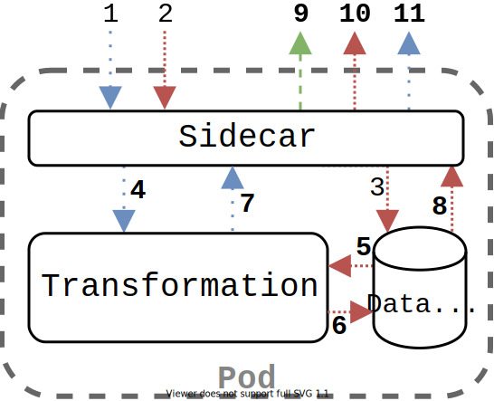

# Iterum Sidecar

---

If you haven't done so already, check out the [main repository](https://github.com/iterum-provenance/iterum) with introductory material.
Additionally, if you have not done so, this package has many dependencies on the shared library called [iterum-go](https://github.com/iterum-provenance/iterum-go). It contains shared/generalized dependencies of this sidecar, the [fragmenter-sidecar](https://github.com/iterum-provenance/fragmenter-sidecar) and the [combiner](https://github.com/iterum-provenance/combiner)

---
## General overview
The sidecar is an application that is attached to every transformation step in a pipeline. It acts as a decoupled interface between the transformation step and the rest of the Iterum stack. It abstracts away from more complex topics such as message queue interaction and dealing with distributed storage in order to keep individual language libraries (such as [Pyterum](https://github.com/iterum-provenance/pyterum) as small as possible. The general flow of a transformation step is shown in the image below, along with a more detailed explanation.

1. The sidecar pulls messages from the message queue containing remote fragment descriptions
2. Then the related data is downloaded from the distributed storage
3. This data is stored on a data volume shared by the two containers in this pod
4. Once downloaded the sidecar lets the transformation know a new message with data is ready to be processed using UNIX sockets
5. The transformation reads the now available data from the data volume
6. Processes its contents and writes the results back to the volume
7. It then informs the sidecar of the completion of processing this fragment
8. The sidecar then gathers the data from the volume again
9. It sends provenance information to the provenance tracker
10. It uploads the processed data to the distributed storage
11. Finally it posts a new remote fragment description on the message queue for the next step in the pipeline

---
## Sidecar structure
The sidecar itself consists of multiple smaller units wrapped up in goroutines. Each of them communicate with their dependents using channels. Most information that is communicated are the various types of `Desc` types, such as `LocalFragmentDesc`, `LocalFileDesc`, `RemoteFragmentDesc`, `RemoteFileDesc`. These are often wrapped up in custom types within their relevant packages such that information specific to that goroutine can be added without it leaving its context (see `messageq/mq_fragment_desc.go` and `socket/fragment_desc` as examples of this).